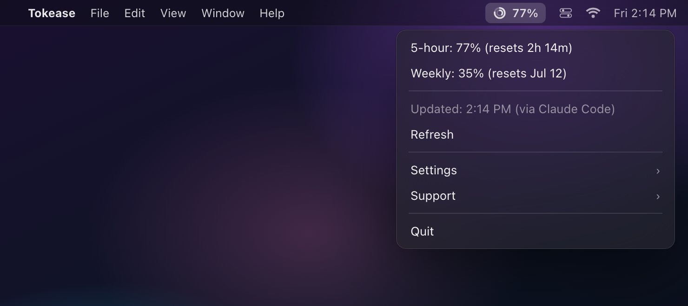

<div align="center">
  
  <h1>Tokease</h1>
  <p>A lightweight macOS menu bar app showing your Claude Code rate limits in real time<br/><strong>The Claude Code limit tracker that never touches your token or Keychain — it reads only what Claude Code already publishes</strong></p>
  <p>
    <a href="https://github.com/tpatrouillat/tokease/actions/workflows/ci.yml"></a>
    
    
    
  </p>
</div>



## Why Tokease

Tokease reads the `rate_limits` data **Claude Code itself publishes to its statusline** — nothing else. No OAuth token read from the Keychain, no hidden API call, no User-Agent spoofing. It's compliant with Anthropic's Terms by construction, not by promise. Other trackers read your subscription token from the Keychain; Tokease never touches it.

Three things it does:

1. **Compliant by construction, not by promise.** The only data source is the `rate_limits` feed Claude Code passes to its statusline script (a documented field). No token read, no endpoint call.
2. **Shows the limit you have left, not the history you spent.** Your 5-hour and weekly remaining capacity, with reset countdowns and opt-in alerts at 80% and 95%.
3. **One file, zero telemetry, zero account.** A small single-file menu bar app, MIT-licensed. It runs entirely on your machine — no telemetry, no account, nothing to sign up for.

## Features

- **Two usage rings** — 5-hour session (outer) + weekly (inner) gauges, right in the menu bar
- **Reset countdowns** — see when each window rolls over
- **Honest freshness** — shows when Claude Code last refreshed the data, and flags it *stale* when Claude Code isn't running
- **Customizable display** — icon + percentage, icon only, or percentage only
- **Settings menu** — launch at login, display modes, alert thresholds (notify at 80% / 95%), refresh interval
- **Lightweight** — pure Python, two small dependencies (`rumps` + `Pillow`)
- **No telemetry** — no account, no tracking, nothing phones home

## Prerequisites

- **macOS** (menu bar app using `rumps`)
- **Python 3.10+**
- **Claude Desktop** running (zero-config source), and/or **Claude Code ≥ 2.1.x** with the statusline wired up (adds reset countdowns)
- **Claude Pro or Max** subscription — the quota feeds only exist for these plans. Claude **Free** doesn't expose them; **Team/Enterprise** use credit-based billing, so the rings don't map and it isn't supported.

## How It Works

Tokease merges two local, read-only sources — whichever is fresher wins:

1. **Claude Desktop history (zero config).** While the Claude desktop app runs, it samples your account quota every ~5 minutes into a local file (`~/Library/Application Support/Claude/plan-usage-history.json`). Tokease reads it as-is. No setup: if the desktop app is running, the rings stay fresh — whatever surface you're using (VS Code extension, claude.ai, Cowork, CLI). See [ADR 0003](docs/adr/0003-source-secondaire-plan-usage-desktop.md).
2. **Claude Code statusline (adds reset countdowns).** A small capture script ([`statusline/tokease-statusline.py`](statusline/tokease-statusline.py)) runs as your Claude Code statusline command; Claude Code passes it `rate_limits.five_hour` / `.seven_day` on stdin and the script writes them to `~/.tokease/usage.json`. This is the only feed carrying the *reset times* shown next to each ring.

In both cases the data is written locally *by an official Claude client* for its own use — Tokease never reads your token and never calls any endpoint. Statusline setup: [`statusline/README.md`](statusline/README.md).

> The legacy endpoint mode (which read the OAuth token) is frozen at the git tag `v0.9.0-endpoint`; v1.0 never reads the token.

This is an independent project, **not affiliated with or endorsed by Anthropic**.

## Quick Install (Homebrew, recommended)

```bash
brew install tpatrouillat/tap/tokease
tokease          # launch immediately
brew services start tokease   # auto-start at login
```

Bypasses Gatekeeper (no Apple Developer signing required), installs the Python virtualenv automatically, and `brew upgrade` handles updates.

## Install from Source

```bash
git clone https://github.com/tpatrouillat/tokease.git
cd tokease
bash install.sh
```

The install script will:
1. Create a Python virtual environment and install dependencies
2. Optionally set up a macOS LaunchAgent for auto-start at login
3. Optionally launch the app immediately

## Manual Install (no install script)

```bash
git clone https://github.com/tpatrouillat/tokease.git
cd tokease
python3 -m venv venv
venv/bin/pip install -r requirements.txt
venv/bin/python tracker.py
```

After installing the app, wire up the statusline capture script — see [`statusline/README.md`](statusline/README.md).

## Uninstall

- **Homebrew:** `brew services stop tokease && brew uninstall tokease`
- **From source:** `bash uninstall.sh` — removes the LaunchAgent, the `~/.tokease/` data, and the Tokease `statusLine` block from `~/.claude/settings.json` (with a backup). Then delete the cloned folder.

## A note on freshness

The percentages are **account-level**: they cover everything on your subscription — claude.ai chat, Claude Desktop (Cowork included), the VS Code extension, and the CLI. The ring is never wrong about how much quota you've used; the only question is how fresh the last reading is.

- **Claude Desktop running** → readings every ~5 minutes, whatever surface you work in. This is the recommended setup: just keep the desktop app open (it lives in your menu bar anyway).
- **Only the statusline wired** → readings refresh while an interactive `claude` terminal session is active (the CLI, or the VS Code *integrated terminal*). The VS Code extension panel, Claude Desktop and headless `claude -p` never execute statuslines ([#55643](https://github.com/anthropics/claude-code/issues/55643), closed "not planned") — with the statusline as sole source, the rings go stale between CLI sessions.
- **Both** (best): desktop history keeps the rings fresh; statusline captures add the reset countdowns whenever you use the CLI.

Stale data is always visibly flagged, and reset windows that have already rolled over are detected — an old percentage is never shown as if it were fresh.

One caveat on the desktop history file: its format is internal to the Claude app and undocumented, so a future update could change it. Tokease parses it defensively (any anomaly → falls back to the statusline feed) and pins its expectations to the observed `version: 2`.

Upstream feature requests that would make this cleaner (Tokease benefits automatically if any of them ships):
- [anthropics/claude-code#38380](https://github.com/anthropics/claude-code/issues/38380) — expose usage/rate-limit data via a CLI flag or hook event
- [anthropics/claude-code#55643](https://github.com/anthropics/claude-code/issues/55643) — statusline support in the VS Code extension
- [anthropics/claude-code#33257](https://github.com/anthropics/claude-code/issues/33257) — native usage indicator

A local, opt-in **drift estimator** (estimate usage between captures from the local session logs all surfaces write) is a v1.1 candidate — see [ROADMAP.md](ROADMAP.md).

## Security

- **Reads no token, ever.** Tokease only reads two local files: `~/.tokease/usage.json` (written by the Claude Code statusline) and the Claude desktop app's own `plan-usage-history.json` (read-only). It never touches the Keychain or your OAuth token.
- **No API calls of its own.** The only network calls involved are the ones official Claude clients already make — Tokease just reads the results they wrote locally.
- **No data collection** — the app runs entirely on your machine.
- **No secrets stored** — no `.env`, no tokens, no credentials on disk.
- **Open source** — audit the code yourself: `tracker.py` plus a small statusline script.

## Running Tests

```bash
venv/bin/python -m unittest discover -s tests
```

(Works with the install-script venv as-is. CI runs the same suite via `pytest` across Python 3.10–3.13; to run it that way locally: `pip install pytest && python -m pytest -q`.)

Tests cover statusline parsing, freshness/reset logic, time formatting, and display logic using mocked data (no real API calls).

## Contributing

Contributions are welcome — see [CONTRIBUTING.md](CONTRIBUTING.md) for dev setup, the lint/test gate, and commit conventions. Please keep the codebase minimal; this is intentionally a small, focused tool.

- Security issues: [SECURITY.md](SECURITY.md) (don't open a public issue).
- What Tokease reads and never touches: [PRIVACY.md](PRIVACY.md).

## Roadmap

v1.0 is **macOS menu bar + Claude Code only** — intentionally narrow. See [ROADMAP.md](ROADMAP.md) for what's explicitly out of scope (iPhone, Windows/Linux, other AI tools) and what might land in v1.1.

## License

[MIT](LICENSE) — Thibault Patrouillat

## Disclaimer

This project is not affiliated with, endorsed by, or sponsored by Anthropic. It relies on the Claude Code statusline `rate_limits` field, which Anthropic may change without notice. Use at your own risk.
